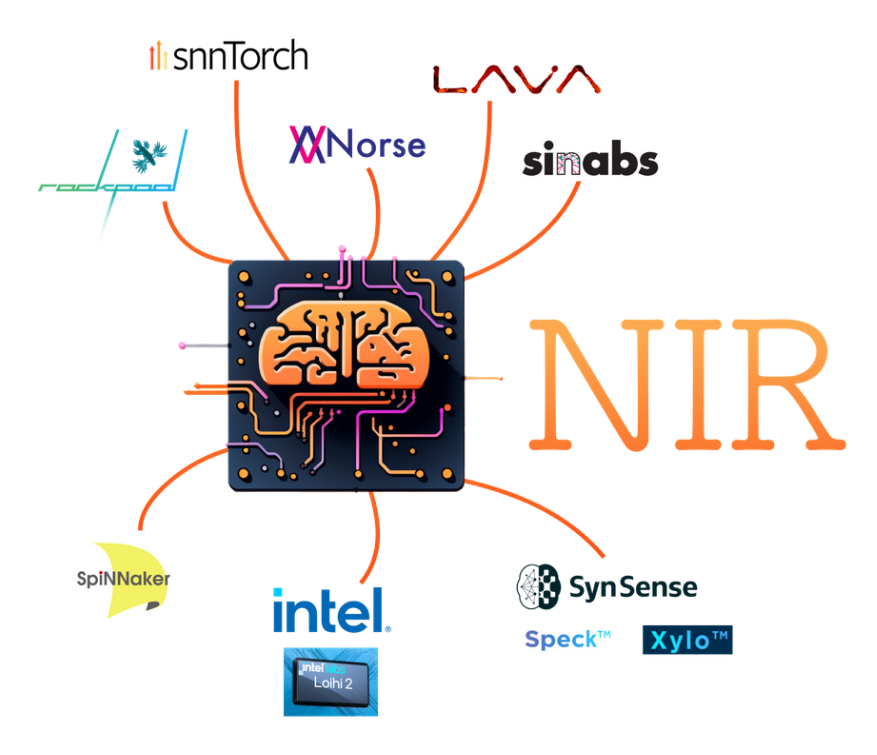

# NIR Tutorial at NICE_2024

## Tutorial on the Neuromorphic Intermediate Representation

This is the landing page for the tutorial on the [Neuromorphic Intermediate Representation (NIR)](https://github.com/neuromorphs/NIR) on 26/4/2024 in San Diegeo at the [NICE conference 2024](https://niceworkshop.org/nice-2024/).

*This page is under construction and will be updated before the event*

**If you plan to join the tutorial at NICE 2024, please check this page again before travelling to the conference. We might ask you to download and install software beforehand.**

